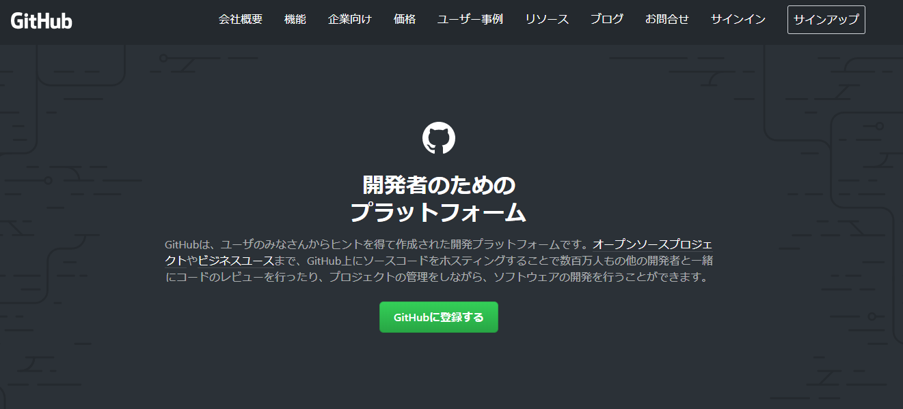
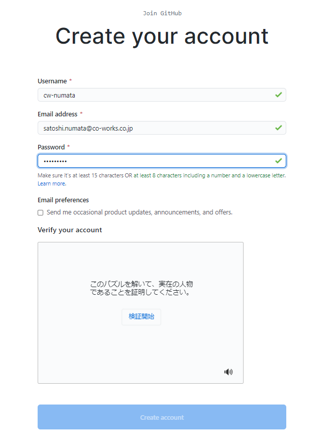
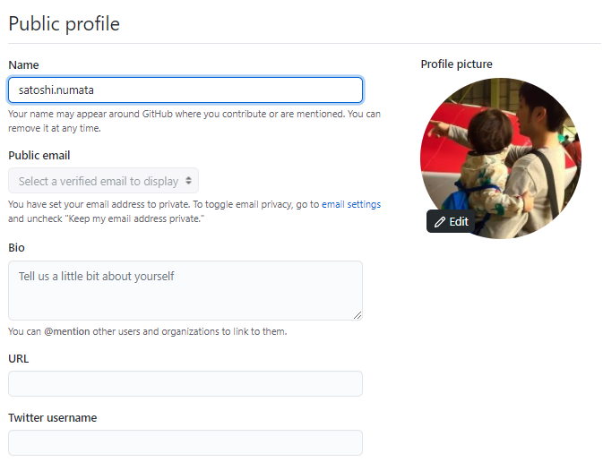

# Github準備

<!-- TOC -->

- [Github準備](#github準備)
  - [GitHubアカウントの作成](#githubアカウントの作成)
  - [リポジトリの確認](#リポジトリの確認)

<!-- /TOC -->
※沼田さん作成のセレクティー様マイページ用資料を流用しています。  
画面ハードコピーなどは流用元のものになっているものが多いので、適時読み替えてください。  

## GitHubアカウントの作成

今回は無料アカウントを作成します。

GitHubにアクセス  
https://github.co.jp/

アカウントを任意の情報で作成します。  
登録したアドレスに承認メールが届くので、承認しアカウントを有効にします。

ログイン後、右上のユーザアイコンをクリックし、Settings→Profileから、プロフィールを変更してください。  
Nameとアカウント画像くらいは変更しておいてください。  
**（このプロフィールは公開されるので注意）**

アカウントが作成できたら、**戸羽までUsernameかアドレスをお知らせください。**  
今回のプライベートリポジトリへアカウントを追加します。

## リポジトリの確認

アカウントを追加後、以下のURLにアクセスし見れることを確認します。  
https://github.com/cw-develop/testea-mypage

以下のREADME.mdを読み、引続き開発環境などを構築します。  
https://github.com/cw-develop/testea-mypage/blob/develop/README.md

