# ローカルPCに開発環境構築
<!-- TOC -->

- [ローカルPCに開発環境構築](#ローカルpcに開発環境構築)
  - [XAMPPのインストール](#xamppのインストール)
    - [概要](#概要)
    - [インストール](#インストール)
    - [設定変更](#設定変更)
      - [おすすめ(任意)](#おすすめ任意)
  - [Node.jsのインストール](#nodejsのインストール)
  - [Comporserのインストール](#comporserのインストール)
  - [VSCodeのインストール](#vscodeのインストール)
    - [インストール](#インストール-1)
    - [プラグインのインストール](#プラグインのインストール)
    - [設定](#設定)
    - [ソースコードの整形について](#ソースコードの整形について)

<!-- /TOC -->
※沼田さん作成のセレクティー様マイページ用資料を流用しています。  
画面ハードコピーなどは流用元のものになっているものが多いので、適時読み替えてください。  

## XAMPPのインストール

### 概要

ローカルPCのMySQLと操作するためのphpMyAdminを利用するためにインストール。  
WebサーバはLaravel組み込みを使用するので、Apacheは使用しない。

### インストール

XAMPPをインストール  
以下のURLよりインストーラーをダウンロード
https://www.apachefriends.org/download.html


**※このLaravelアプリケーションは、  
XAMPP for Windows 8.1.XX（PHP8.1系）での動作を想定しています。
（2023.9時点）**  

古いバージョンのXAMPP環境が既にある場合、
XAMPPのセットアップウィザードでは、XAMPPの上書きアップデートが実行できません。
既存のXAMPPインストールフォルダとは別に新しいXAMPP環境を追加でセットアップするか、事前に旧バージョンのXAMPPをアンインストールしておく必要があります。  

以下は、通常インストール手順。

ダウンロードしたインストーラを起動し、OKをクリックする。  
(Program Filesに保存するなという警告)

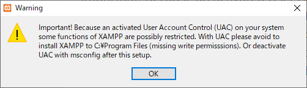

とりあえずそのまま進めてインストールを完了する。  
途中でファイアーウォールの警告が出るがキャンセル(無視)でも良い。

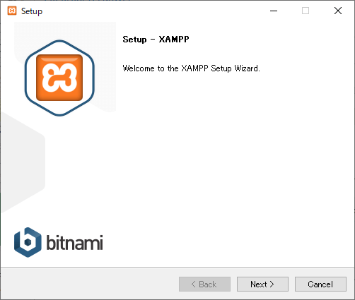

インストール完了後、以下の実行ファイルのショートカットをデスクトップに作成する。  
(起動を行う実行ファイル)

```
C:\xampp\xampp-control.exe
```

※複数バージョンのXAMPP環境をインストールし、切替を行う必要がある場合、
戸羽は以下を参考に、インストールし切替を行っています。
https://arubeh.com/archives/1381
（もっとよい方法がありましたらおしえてください。）

### 設定変更

先程の実行ファイルを起動する。  
大体80ポートは誰かが使っているので、変更しておく。

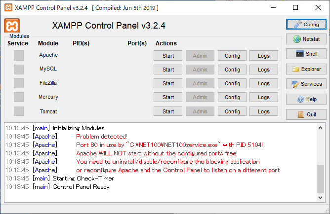

ApacheのConfigをクリックし、`Apache(httpd.conf)`をクリックする。

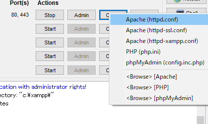

以下の行を変更し、80→8088にした。  
(8088は任意です)

```
Listen 8088
ServerName localhost:8088
```

configをクリックする。

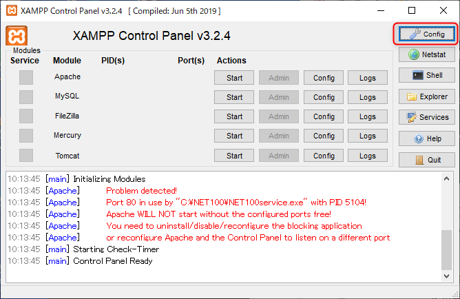


以下のボタンをクリックする。

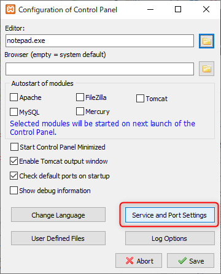


先ほどと同じポートを指定する。

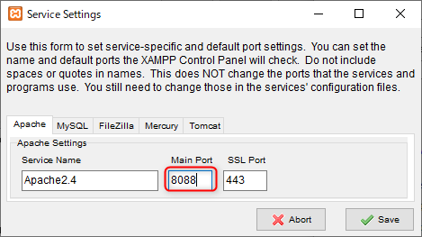


Startボタンをクリックし、Apacheを起動する。


以下にアクセスして画面が見れるとOK。  
http://localhost:8088/


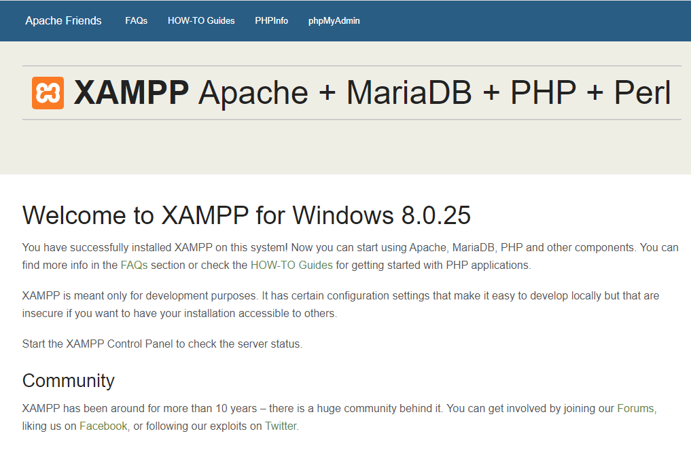

次にMySQLを起動する。  
ファイアーウォールの警告はキャンセル(無視)して良い。

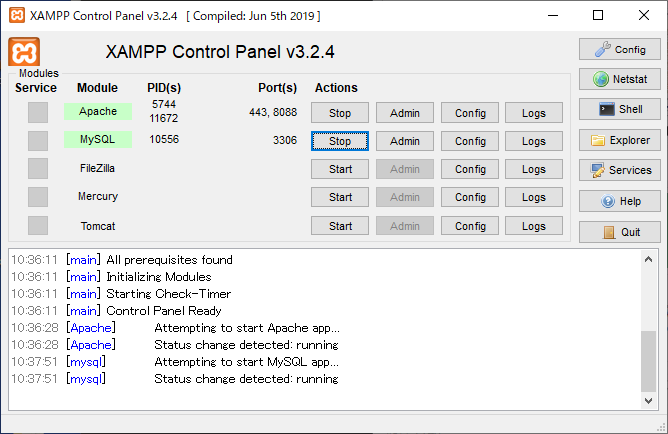


ApacheもMySQLも起動した状態で、以下の`Admin`をクリックする。

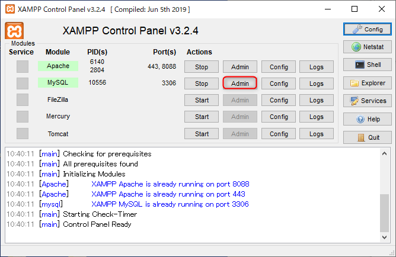

phpMyAdminという、ブラウザからMySQLを操作する管理画面が表示される。  
さくらのレンサバもそうだが、MySQLの操作をするのによく使われるツールであり、開発時も使う。


#### おすすめ(任意)

ローカル環境でDBのデータ参照・更新を行うときは、`A5:SQL Mk-2`が便利。 
フリーのSQLクライアントソフトです。 
https://a5m2.mmatsubara.com/

※さくらのレンサバのデータベースにはアクセスできません。  


## Node.jsのインストール

Laravel開発にて、npmを使用してパッケージのインストールや、Javascriptファイルなどをビルドします。

Node.jsをインストールする。  
https://nodejs.org/ja/download/  

**※このLaravelアプリケーションのビルドを行うには、Node.jsのバージョンが16以上である必要があります。**

Windowsのインストーラをダウンロードし、インストールを完了する。


## Comporserのインストール

Comporserとは、PHP向けのパッケージ管理システムです。


以下にアクセスし、インストーラをダウンロードする。  
→Comporser - Setup.exe  
https://getcomposer.org/download/


特に設定を変えずに、そのままインストールを完了させる。  
途中、既にXAMPPがインストール済みなので、そのパスが指定されていることを確認する。


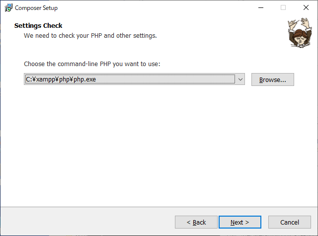


## VSCodeのインストール


### インストール

VSCodeをインストールする。  
https://code.visualstudio.com/download

Windows版をダウンロードし、普通にインストールする。

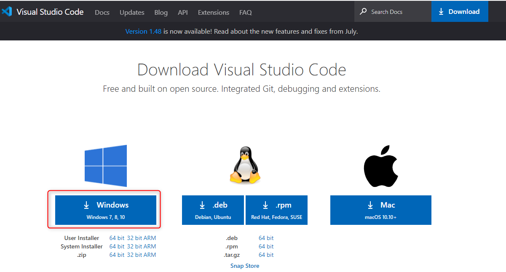

### プラグインのインストール

VSCodeの拡張機能をインストールする。  
以下のアイコンをクリックする。


以下の赤枠の通り検索ボックスに入力し、インストールしていく。


1. Japanese Language Pack for Visual Studio Code  
日本語化  


2. Laravel Blade Snippets  
LaravelのテンプレートのBladeをサポートする。  


3. Laravel Assist  
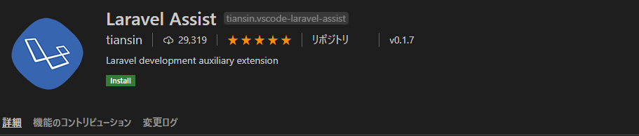

4. PHP Intelephense  


5. Prettier - Code formatter  
ソースコードの整形(フォーマッター)  


6. zenkaku  
全角を表示する  


7. Vetur  
Vueの開発用  
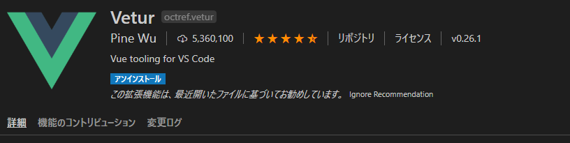


### 設定

VSCodeの設定を開く。


`blade.format.enable`と入力し、チェックを入れる。

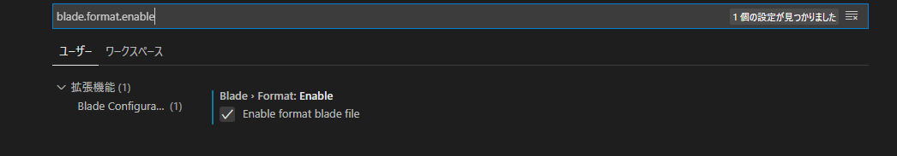


### ソースコードの整形について

VSCodeでソースを開いているとき、以下のショートカットでソースコードの整形ができます。  

```
shift+alt+F
```

- Gitのコミット前にはソースを整形しておく
- ショートカットを押した際、どのフォーマッタを使うか聞かれたら、`Prettier`を指定する。

