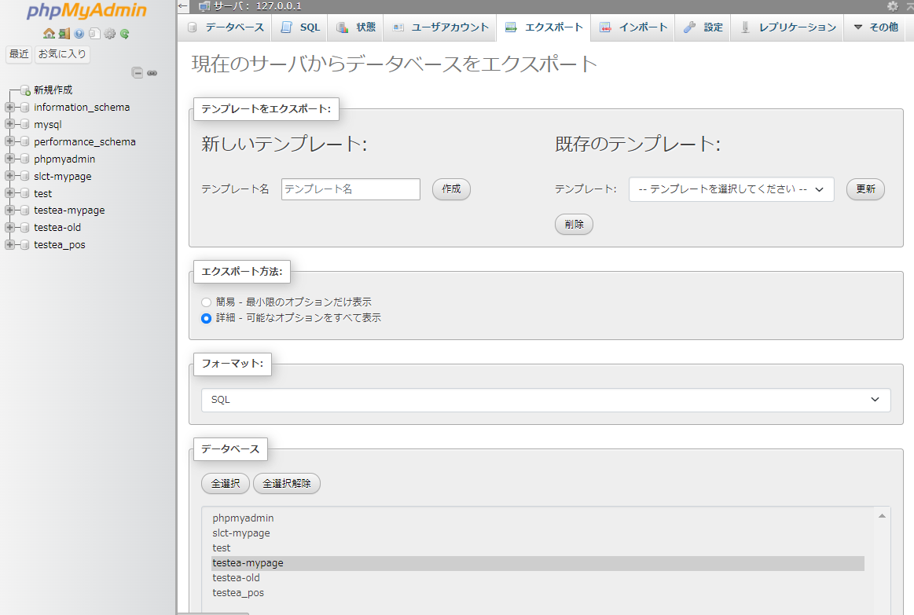
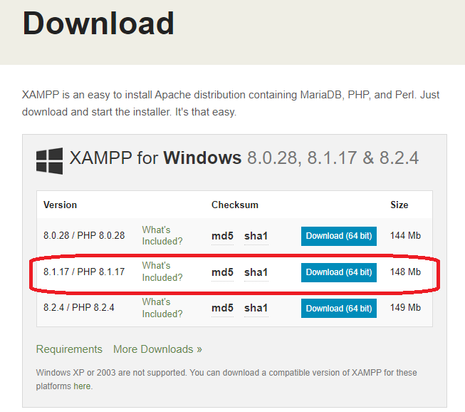
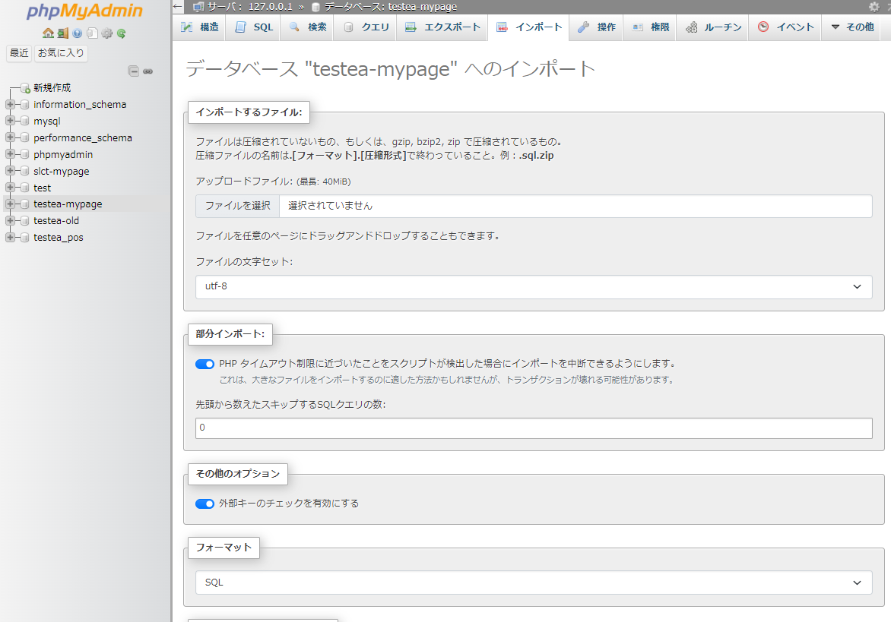

# ローカル開発環境のバージョンアップ
<!-- TOC -->

- [ローカル開発環境のバージョンアップ](#ローカル開発環境のバージョンアップ)
  - [XAMPPのアンインストール・インストール](#xamppのアンインストールインストール)
    - [概要](#概要)
    - [データベース（モック環境用）のバックアップ](#データベースモック環境用のバックアップ)
    - [既存のXAMPPのアンインストール](#既存のxamppのアンインストール)
    - [新しいバージョンのXAMPPインストール](#新しいバージョンのxamppインストール)
  - [データベース](#データベース)
    - [データベースのインポート（モック環境用DB）](#データベースのインポートモック環境用db)
    - [開発用のデータベース作成・ユーザー追加](#開発用のデータベース作成ユーザー追加)
  - [.env設定・起動確認](#env設定起動確認)
    - [developの最新ソース取得](#developの最新ソース取得)
    - [.envファイル設定](#envファイル設定)
    - [開発環境用テーブル作成・初期データ登録](#開発環境用テーブル作成初期データ登録)
    - [動作確認](#動作確認)

<!-- /TOC -->

## XAMPPのアンインストール・インストール

### 概要

既存のXAMPP環境があるが、新しいバージョンのXAMPP（PHP）を入れる必要がある場合に必要な作業となります。  
古いバージョンのXAMPP環境が既にある場合、
XAMPPのセットアップウィザードでは、XAMPPの上書きアップデートが実行できません。  
既存のXAMPPインストールフォルダとは別に新しいXAMPP環境を追加でセットアップするか、事前に旧バージョンのXAMPPをアンインストールする必要があります。  
以下なども参考にしてください。  
https://www.tairaengineer-note.com/xampp-update/  

### データベース（モック環境用）のバックアップ

XAMPP（既存）のApacheとMySQLを起動し、phpMyAdminを開く。  

上部メニューより エクスポートを選び、対象のデータベースをエスポートする。  （以下、お好みで）  
・左メニューでDB未選択の場合：エスポート詳細オプションから対象DBを選ぶ。デフォルトでCREATE DATABASE文が入ったファイルが出力される。  
・左メニューでDB選択の場合：選択されたDBのエクスポート。デフォルトでCREATE DATABASE文が入っていないファイルが出力される。  
（新環境でデータベース名を変えたい場合はこちらがよいかも）  



以降の作業のため、XAMPPの各パッケージ・コントロールパネルを終了しておく。

### 既存のXAMPPのアンインストール

必要に応じて、既存のXAMPPをアンインストールする。
（アンインストールせず、既存のXAMPPインストールフォルダとは別に新しいXAMPP環境を追加でセットアップしてもよい。お好みで。）

以下など参考にしてください。  
https://www.tairaengineer-note.com/xampp-uninstall/


### 新しいバージョンのXAMPPインストール

XAMPPをインストール  
以下のURLより新しいバージョンのインストーラーをダウンロード
https://www.apachefriends.org/download.html



**※このLaravelアプリケーションは、  
XAMPP for Windows 8.1.XX（PHP8.1系）での動作を想定しています。
（2023.9時点）**  

XAMPPインストール・設定手順は、03_ローカルPCに開発環境構築 を参照のこと。


## データベース

### データベースのインポート（モック環境用DB）

XAMPP（新環境）のApacheとMySQLを起動し、phpMyAdminを開く。  

バックアップで取得したエクスポートファイルに `CREATE DATABASE` が入っていない場合は、  
左メニューの「新規作成」をクリックし、データベースを新規作成する。
（04_プロジェクトの読み込みと起動 を参照）

上部メニューの インポート より、バックアップファイルを指定しデータベースをインポートする。



### 開発用のデータベース作成・ユーザー追加

データベース作成・ユーザアカウントの追加と権限設定を行う。  
データベース名は、先ほどインストールしたデータベースとは別名で作成する。  
手順は、04_プロジェクトの読み込みと起動 を参照のこと。  


## .env設定・起動確認

### developの最新ソース取得

developブランチのソースをpullする。


### .envファイル設定

「.env」ファイルのDBに関する設定を以下のように修正する。  
※DB名やユーザ名、パスワードは上記で作成したものに変更

※以下は開発環境用サンプル（DB名は開発用のものにすること）
```
DB_CONNECTION=mysql
DB_HOST=127.0.0.1
DB_PORT=3306
DB_DATABASE=testea-mypage
DB_USERNAME=laravel-user
DB_PASSWORD=pass
```

**※モック環境（mock_20230915ブランチ）に切り替えて作業する場合は、`DB_DATABASE`をモック用DB名に変更する**  


### 開発環境用テーブル作成・初期データ登録

VSCodeのターミナルより、以下を実行する。  

migrationコマンドを実行し、テーブルを作成する。  
```
php artisan migrate
```

全テーブル再作成する場合は、`:fresh` を付ける
```
php artisan migrate:fresh
```

テーブルに初期投入データを登録する。
```
php artisan db:seed --class=MypageDummyDataSeeder
```

### 動作確認

システム起動し、ログイン・画面表示ができることを確認する。

