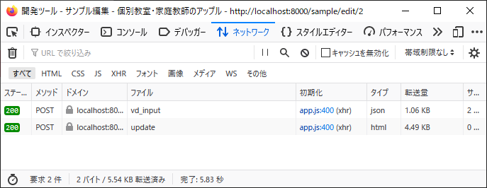

# 処理の実装についてその２

<!-- TOC -->

- [処理の実装についてその２](#処理の実装についてその２)
  - [migrationの運用について](#migrationの運用について)
  - [テストデータについて](#テストデータについて)
  - [画面仕様について](#画面仕様について)
  - [モック用ブランチ](#モック用ブランチ)
  - [ソースチェック](#ソースチェック)
  - [モック→実装](#モック実装)
    - [Blade](#blade)
      - [各項目のid](#各項目のid)
      - [select（プルダウン）](#selectプルダウン)
      - [一覧表示やモーダル表示](#一覧表示やモーダル表示)
      - [編集画面やモーダルへのパラメータ（id等）](#編集画面やモーダルへのパラメータid等)
    - [BladeかVue.jsか](#bladeかvuejsか)
    - [Controller](#controller)
      - [共通処理について（戸羽追記）](#共通処理について戸羽追記)
      - [バリデーションについて](#バリデーションについて)
    - [model](#model)
    - [JS](#js)
  - [ファイルアップロード系](#ファイルアップロード系)
  - [デバッグログについて](#デバッグログについて)
  - [SQLの表示](#sqlの表示)
  - [JSのデバッグ](#jsのデバッグ)
  - [ブラウザについて](#ブラウザについて)
  - [ローカル開発環境にスマホでアクセス](#ローカル開発環境にスマホでアクセス)
  - [サンプル処理の補足](#サンプル処理の補足)
    - [SQLについて](#sqlについて)
      - [joinについて](#joinについて)
      - [SQL](#sql)
    - [不正アクセス対策](#不正アクセス対策)
      - [GETリクエスト時のURLパラメータ](#getリクエスト時のurlパラメータ)
      - [直接POSTその１(不正アクセス)](#直接postその１不正アクセス)
      - [直接POSTその２](#直接postその２)
      - [直接POSTその３](#直接postその３)
      - [詳細取得時のIDチェック](#詳細取得時のidチェック)
      - [詳細・一覧取得の項目](#詳細一覧取得の項目)
  - [サンプル処理の補足の補足](#サンプル処理の補足の補足)

<!-- /TOC -->
※沼田さん作成のセレクティー様マイページ用資料を流用しています。  
画面ハードコピーなどは流用元のものになっているものが多いので、適時読み替えてください。  

## migrationの運用について

開発時には、ある程度テーブルの変更が想定される。  
その都度、差分のmigrationファイルを作成すると管理が大変になる。  
そのため、開発時にテーブルの修正が入った場合は、既存のmigrationファイルを修正して良いとする。

ただし、通常のmigrationコマンドでは最新化できなくなるため、以下のコマンドで強制的に最新化する。

```
php artisan migrate:fresh
```

このやり方の場合、テーブルがすべて削除され作り直される。  
データが消えてしまうので注意。タイミングを見て各自実施すれば良いと思う。  

## テストデータについて

上記のmigrationの話と絡むが、毎回データが削除されると面倒。  
そもそもテストデータを各自で用意するのが大変である。

実装用の初期投入データを準備しており、以下のコマンドでテストデータが登録される。  
→それにより、migrationし直しても、すぐにデータを用意できる。

```
composer dump-autoload
php artisan db:seed --class=MypageDummyDataSeeder
```

## 画面仕様について

実装の際にUI的にとか、実装都合で、細かい挙動は見直す可能性はあります。ご了承ください。  
→入力エラー時のエラーダイアログは対応しない。バリデーションエラーなので。


## モック用ブランチ

モック用ブランチは、以下に退避した。  
`mock_20230915`

developブランチを実装用に整備しており、developをベースに実装を始める。  
お客様から要望があれば、モックもdevelopも合わせて修正する必要がある。

## ソースチェック

プルリクエストの機能を使い、ソースのチェックを行ってからdevelopブランチに
マージする予定。  
（ブランチ運用方法は別途まとめる）  
スケジュール的に、単体テスト仕様書作成や単体テストフェーズを設けられないため、  
実装時には各自、動作確認は念入りにお願いします。  
実装後は、MySQLのテーブルにデータが登録・更新されるかなど、そういうレベルでの確認をお願いします。  


## モック→実装

基本的に、マイページサンプル（`mypage_sample`レポジトリ）の既存機能・類似機能のソースを参考に流用し作成する。  
今回の実装環境でも、いくつかサンプル実装した機能があるので、そちらを参考にする。  
- 運用管理_ブースマスタ管理：ひととおり  
- 講師向け_授業報告書：一覧画面検索・表示のみ  
- 講師向け_生徒成績：一覧画面の検索項目リスト表示のみ  

ただ、細かい点で考慮が必要なケースや、ある程度実装が進んだ段階で共通化（リファクタリング）などは随時行っていくことになる。

実装にあたり、ポイントを以下にまとめる。  

### Blade

#### 各項目のid
項目の名前（id）を、テーブルの項目に合わせて修正する。  
モックは作成時に既存画面から流用しているため、idが適当な名前になっている。  

コントローラーでは、テーブルから取得した項目を `editData`にセットし、受け渡す。

```
<x-input.select id="aaaa" caption="生徒名" :select2=true>
    <option>山田 太郎</option>
    <option>鈴木 花子</option>
</x-input.select>
```

#### select（プルダウン）
ダミーの選択項目を削除し、以下のようにする。  

```
<x-input.select id="campus_cd" caption="校舎" :select2=true  
  :mastrData=$rooms :editData=$editData  
	:select2Search=false :blank=true />
```

以下が正しく設定されているか、確認してください。  
- :mastrData      ：プルダウンの選択項目リストを設定  
- :editData       ：編集画面など初期値がある場合に設定  
- :select2Search  ：プルダウンに文字列検索を使用する場合にtrue  
　※リスト項目数が多く、検索入力が必要なものはtrueにする（生徒・講師・科目等）  
- :blank          ：プルダウンに未選択（選択してください）を含める場合にtrue  
　※検索項目（教室管理者の校舎選択以外）はtrueにする  
　※登録画面では、選択必須でリスト先頭を初期選択とする場合falseにする  

#### 一覧表示やモーダル表示
ダミーデータが設定されているところは、コントローラーで取得したデータを表示できるようにする。  

#### 編集画面やモーダルへのパラメータ（id等）
ダミーで固定値が設定されているところは、動的に取得データのキー項目を設定する。

```
{{-- 編集 URLとIDを指定。IDはVueで指定される。 --}}
<x-button.list-edit vueHref="'{{ route('master_mng_booth-edit', '') }}/' + item.id" />
```


### BladeかVue.jsか

＠がついているのはVue.js。  
同期処理か非同期処理かで違うので、どちらを使用するか意識する。

Vue.js（非同期通信）
```
    <tr>
        <th width="35%">通知日</th>
        <td>@{{item.date}}</td>
    </tr>
```

Blade（同期通信）
```
    <tr>
        <th width="35%">時間</th>
        <td>{{$jikan}}</td>
    </tr>
```

### Controller

大体、画面のイベントを空の関数で用意しているので、各関数に処理を記述する。  
（web.phpに記載のルーティングに紐づく関数をコントローラーに定義）  

プログラム内変数は、

IDをキーにデータ取得する処理が多いが、本来見えないデータを見せないようにガードを掛ける必要がある。  
→サンプル処理では考慮していないが、whereにIDだけで絞るのはNG。他人のデータを見られる可能性があるので、対策は必要。  
今回のサンプル実装や、共通処理にはガードを入れているので参考にする。後でまとめてチェックが必要  
（後述）

#### 共通処理について（戸羽追記）

Controllerが肥大化しないよう、共通化できる処理・ビジネスロジックはできるだけ外出しにする。  
共通処理は以下に配置する。

`app\Http\Controllers\Traits`

作成済みの主な共通処理ファイル
→既存のTraitファイルについて、どんな処理が共通化されているか実装前に確認しておく。  

- `CtrlModelTrait.php` ：モデルと関連する機能共通処理  
  プルダウンメニュー用リスト取得・名称取得・where条件など  
  ※今回用に改修済み。今後も見直し・追加予定。  
  →自分が実装する機能で、新たに追加したいものや、既存の処理と取得条件が少し異なるものがほしい、などあれば対応しますので、戸羽までお知らせください。  

- `GuardTrait.php`：リクエストを権限によってガードを掛けるための共通処理  
  他人のIDを見れないかなど、生徒・講師・教室管理者の場合にそれぞれガードをかける。（ガード処理については後述）  
  ※今回用に改修済み。今後も見直し・追加予定。
  →`CtrlModelTrait`と同様  

- `FuncXXXXXXTrait.php`：各機能用の共通処理・外出し処理  

上記の他に、スケジュール登録関連の処理など外出しにしてまとめたいと思っている。  
ブースの検索処理・空きチェック、時間割の開始終了時間チェックなど。  


#### バリデーションについて

一般的なLaravelの機能を使う。  
可能な限りかけておく。随時レビューしながらチェックしていく。
特に今回非同期の通信が多く、かつ、権限によって見れる見れないがあるので、念入りに掛ける必要がある。
テーブル項目の個々のバリデーションルールは、モデルの `getFieldRules()` で定義する。  
このルールに、関連チェック（複数項目の関連や重複チェック、リストチェックなど）をコントローラーで加えて定義する。  既存ソースを参考にする。  


### model

各検索項目に対する、データ取得時の絞り込み条件（where句の付加）は、モデルのスコープ（`scopeSearchXXXXX`）で定義する。

### JS

修正なしのものが多いが、changeイベントがある画面については対応が必要。  


## ファイルアップロード系

ファイル取り込みについても既存処理を参考に流用する。  
事前バリデーションを行う。もちろん取り込み時もチェックする。  
→ファイルサイズが大きいのは試してみて検討

考えられるエラーとは、ファイルを選択間違えたくらいなのでは。  
なので、ヘッダのチェックは行う。  
→システム出力なので、ヘッダがあっていれば、データの中身が間違ってるとは考えにくいような。

既存処理では。以下のチェックを行っている。

- ファイルのヘッダの各項目名が想定通りか
- 各データ行の列数が、ヘッダ項目数と同じか
- 各データ行の、値のバリデーション（登録先テーブルの項目と同様に、必須、数値型か、文字型か、桁数など）

※戸羽追記  
エラーメッセージは、既存マイページのスケジュール取込み・会員情報取込みで詳細情報の出力に対応している。（エラー項目や行数等）  
今回はこちらをベースに、詳細情報も出力する。（テスティ―様からの要望があったため）  


## デバッグログについて

コントローラでは、以下の記述でログが出せる。(変数でも配列でもオブジェクトでも)

```
$this->debug(変数);
```

ログファイルは以下。

```
\web-testea\storage\logs\laravel-yyyy-mm-dd.log
```

Laravelのddという関数でも出せるが、今回、非同期通信が多いので使えない。  
ログファイルに出すのが手っ取り早い。

デバッグログ出力は削除してからプッシュしてください。

## SQLの表示

今回はSQL文を直接使用せず、モデルを介して実行する。  
モデルを使用すると、実際にどんなSQL文が実行されているかわからない。

以下のように、実行する最初と最後に行を追加するとSQL文をログに出力できる。

```
\DB::enableQueryLog();

// 何らかモデルの操作
$samples = $query
    ->select(
        'samples.id',
    )
    ->get();

$this->debug(\DB::getQueryLog());
```

こんな感じで見れる。
仕様どおりに正しくSQL実行されているか、SQLを確認しながら実装してください。

```
  1 => 
  array (
    'query' => 'select `samples`.`id`, `sample_text1`, `sample_text2`, `sample_int1`, `sample_date1`, `users`.`name` from `samples` left join `users` on `samples`.`sample_int1` = `users`.`id` where `samples`.`deleted_at` is null',
    'bindings' => 
    array (
    ),
    'time' => 45.34,
  ),
```

## JSのデバッグ

ブラウザを開いて、開発者ツールを使う。  
スマホ表示も可能だし、JSのエラーも表示できる。


## ブラウザについて

```
php artisan serve
```
でサーバー起動できるが、Chromeの場合、Localhostへのアクセスが遅いようだ。  
組み込みサーバーを以下のように引数を付けて起動するとよいかも。

```
php artisan serve --host 0.0.0.0
```

Chromeの場合は、以下のURLでアクセスする。

```
http://127.0.0.1:8000/
```

なお、IEについては現時点で動かない・・(サポートブラウザではないので対応はしない)


## ローカル開発環境にスマホでアクセス

サーバーの起動を以下にする。

```
php artisan serve --host 0.0.0.0
```

※戸羽追記  
また、JSのビルドコマンドを以下にする。（プライベートIP指定）  
プライベートIPアドレスは、ipconfigコマンドで調べる。  

```
npm run dev -- --host 192.168.xx.xx
```
（`--` と `--`の間にスペースが入ります）  

PCと同じwifiに接続しているスマホからアクセスする。

例；  
http://192.168.xx.xx:8000/  


## サンプル処理の補足

知識の共有も含めてまとめた。  
基本はサンプル処理どおりに作れば良いので参考まで。

### SQLについて

#### joinについて

通常のLaravelのJOINは論理削除に対応していない。  
参考：https://qiita.com/danishi/items/726fcbed683c03ef389e

クエリビルダを拡張して、以下の関数を追加。  
通常のJOINに、モデルを渡す。  
これで論理削除に対応するようにしました。(っていうかLaravelも対応すればいいのに)

```
->sdLeftJoin(Account::class, 'samples.sample_int1', '=', 'account.account_id')
```

使い勝手は、通常と同様。  
クロージャも対応

```
->sdLeftJoin(Account::class, function ($join) {
      $join->on('samples.sample_int1', '=', 'account.account_id');
      $join->on('samples.sample_int1', '=', 'account.account_type');
})
```

拡張したJOINがうまく行かない場合、一旦、通常のJOINを使っておいてください。  
確認して対応します。


#### SQL

rawメソッド(SQL文を直接書く) は極力使用しない。  
基本はEloquentを使用する。

使わないといけないケースがありそう。  
例えば、既存ソースの以下のようなもの。モデル側に共通関数用意したい。

```
->orderByRaw('CAST(code AS signed) asc')
```

### 不正アクセス対策

#### GETリクエスト時のURLパラメータ

変更時や詳細のGETのURLの場合、IDなどがURLに追加され、その値をもとに処理を行う。  
今回、権限によって見れる・見れないが違うため、以下のURLがログインしているユーザに対して、本当に見れるのかどうかはチェックす必要がある。

GETパラメータは容易に変更ができるため、**防ぐ必要**がある。  
コントローラーのedit()処理などの先頭で、パラメータチェック処理・ガード処理を入れるようにする。  
（既存処理を参考に）

```
http://localhost:8000/sample/edit/2
```

#### 直接POSTその１(不正アクセス)

通常はブラウザの画面を通じて操作を行う。  
が、Webアプリの特性上、画面を通さずにリクエストを送ることが可能である。

編集画面の場合、以下のような処理となっている。  
- データのバリデーションを実施（vd_inputを呼ぶ）  
  - バリデーションエラーの場合は、エラーメッセージを表示
- バリデーションが問題なければ、確認ダイアログの表示
  - キャンセルボタンで画面に戻る
- OKボタン押下後、更新処理を実施（updateを呼ぶ）

これは開発ツールを確認すると分かる。  



なおこの挙動については、沼田が実装したので、どのWebアプリもそうなっているとは限らない。  
が、画面を遷移するタイプであろうと、確認画面を挟もうと、最後にはupdate処理は必ず呼ぶはず。

処理をまとめると、**バリデーションでエラーがなければ、update処理が呼ばれる**という動きである。

では、update処理自体ではバリデーションを行う必要がないのかといえば、そういうわけには行かない。  
直接POSTを行うことができるからである。
(画面からの操作ではできないが、やろうと思えばできる、わかりやすくここでは不正アクセスと呼ぶ)

手っ取り早く、Firefoxの開発ツールで、updateのみ送信は可能。  
CSRFのトークンも送るので、弾くことができない。


なので、updateでバリデーションを行わないと、不正な値を挿入される可能性がある。  
searchやcreateも同じ理由ではあるが、以下のように、update時にバリデーションは必須である。  
抜けてたら必ず足してください。これはWeb系では必須です。

```
    /**
     * 編集処理
     * 
     * @return 結果
     */
    public function update(Request $request)
    {

        // 登録前バリデーション。NGの場合はレスポンスコード422を返却
        Validator::make($request->all(), $this->rulesForInput())->validate();
```

あと、なんでバリデーションの時と書き方が違うのかというと、上記でエラーになるのは、不正アクセスしかありえないためである。  
そういう場合は、律儀にエラーメッセージ返す必要もなく、レスポンスエラー返して置けば良い。
（エラーダイアログとか不要。そもそも画面操作ではないはずだし）

#### 直接POSTその２

送信されるリクエストは、必ず、onlyで絞る。    
先程と同様、画面から送信される場合、画面に存在するinputデータしか送信されない。  
不正アクセスの場合、自由にリクエストパラメータを追加できるので、必ず使用するリクエストのみに絞る。

```
$form = $request->only(
    'id',
    'password'
);
```

以下のように、リクエストデータをそのまま使用しての更新はNGである。  
(画面に存在しないデータを送信され、テーブルに項目が存在する場合、不正に更新ができてしまう)  
ググるとLaravelのサンプル処理で書かれているやつ。

```
$sample->fill($request->all())->save();
```

#### 直接POSTその３

バリデーション処理で、プルダウンの値が正しいかのチェックを入れている。  
これも画面からはプルダウンで選択しかできないが、直接POSTで、選択にない値で更新できてしまうためガードをかけている。  
JOINして名称がでるとまずいケースもある。
既存処理を参考に、対応してください。


#### 詳細取得時のIDチェック

GETパラメータと同様だが、モーダルを開く際に、IDを送信してデータを取得している。  
こちらも本当にそのIDがみえるデータかチェックする必要がある。

#### 詳細・一覧取得の項目

詳細取得時や、検索結果一覧は、今回は非同期で取得する。  
そのため、応答結果としてデータを返却している。  

その際に、**必ず画面に表示する項目のみselectする**。  
画面に表示しないからといって、全項目取得するのはNGである。  
→開発ツールで、応答結果が見えるため。パスワードや、生徒が見えないはずのデータなどを返却しない。

```
->select(
    // idという名前がカブるのでテーブル名を指定
    'samples.id',
    'sample_text1',
    'sample_text2',
)
```

## サンプル処理の補足の補足

- 不正アクセス系は画面から操作できないのでテストしづらい・・。今回無理だと思うが、本当はPHPUnitなどの単体テストやりたかった。しょうがないので、ソース確認は各自しっかりお願いします。
- Web系開発時に、毎回全部必要なのかというと、許容するケースもあるかと思います。  
  例えば、社内システムの場合で管理システムの場合。（社内システムに不正アクセスするやつはいないだろうし、言えば良いと思う）
- 管理画面と公開画面が別れていて、管理画面が社内の人しか使わないケース。（上記と同様）
- 不特定多数が使う場合や、今回のように権限によって公開範囲が違う、ECサイトのように個人情報を扱うケースなど、やっぱり気をつけるに越したこと無い。  
- 不正アクセスする暇なやつはそうそういないと思うが、「不正アクセスするほうが悪い」とも言ってられないので、やっぱり対策は必要ですね。


