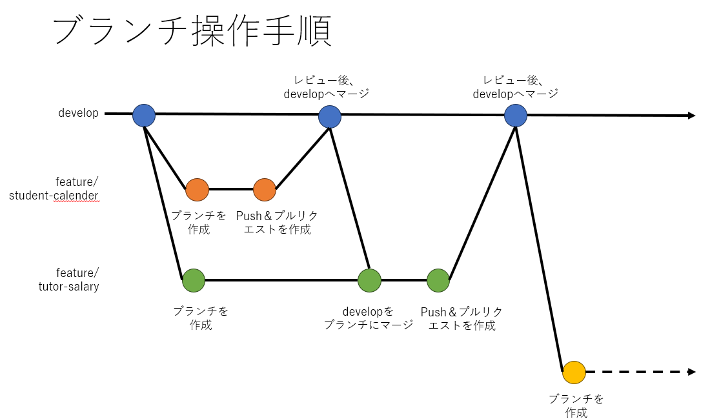

# Github運用ルール・操作手順

<!-- TOC -->

- [1. Issueの作成](#1-issueの作成)
- [2. branchの作成](#2-branchの作成)
  - [ブランチについて](#ブランチについて)
  - [ブランチ作成ルール](#ブランチ作成ルール)
- [3. ブランチ運用手順](#3-ブランチ運用手順)
  - [作業者](#作業者)
  - [レビュアー](#レビュアー)
  - [developブランチから最新のソースコードをマージ](#developブランチから最新のソースコードをマージ)

<!-- /TOC -->

## 1. Issueの作成

Githubのプロジェクトのページで、Issueを作成する。  
* Issues > [New issue] から、Issue作成画面を表示する。
* タイトルを入力
  * 例）実装 - マスタ管理 ブースマスタ（運用管理）
* Labelsで任意のラベルを選択
  * 後から追加・変更も可能
* [Submit new issue]を押下し、Issueを作成する。

作成したIssue番号をコミット時のコメント、プルリクエストのコメントに記載する。

## 2. branchの作成
### ブランチについて
| ブランチ名 | 役割 | 派生元 | マージ先 |
| ---- | ---- | ---- | ---- |
| master | 公開するものを置くブランチ<br>※開発では未使用 |  |  |
| develop | 開発中のものを置くブランチ | master | master |
| feature/ユーザ-機能名 | 新機能開発中に使うブランチ<br>※プルリクマージ後削除 | develop | develop |

### ブランチ作成ルール
ブランチ名は、以下のルールで命名する。
* feature の後は”/”(スラッシュ)  
* ユーザと機能名の間・機能名の単語の間は”-”(ハイフン)
  * 機能名は、ルーティングやファイル名を参考にする
```
例）
生徒向け　カレンダー				：　feature/student-calender
講師向け　給与明細				：　feature/tutor-salary
運用管理　マスタ管理-ブースマスタ	：　feature/manage-booth-master
```

## 3. ブランチ運用手順
### 作業者
1. ローカル環境でdevelopブランチから、作業用ブランチを作成
2. 作業用ブランチで、開発を行う
3. 定期的に、[developブランチから最新のソースコードをマージする](#developブランチから最新のソースコードをマージ)
4. 機能の開発完了し、テスト・動作確認後、ソースコードのフォーマットを行い、ソースをcommitする
5. リモート環境へブランチをpushする
6. GithubのWebページへアクセスし、作業用ブランチを表示する（切り替える）
7. プロジェクトの上部に表示されているメッセージ、  
または、[Pull requests]タブで表示したページの上部のメッセージの  
[Compare & pull request]ボタンを押下し、プルリクエスト画面を表示する
8. プルリクエスト画面で内容を入力する
    - base : マージ先のブランチを選択（develop）
    - compare : 作業用ブランチ
    - タイトル : 
    - コメント : テンプレートの内容を元に記載する。不要な部分は削除する。  
    - Previewでコメントの表示を確認すること
9. マージ先・マージ元のブランチの表示で、マージ可能(Able to merge.)になっていることを確認する  
  conflictが発生している場合など、画面上にエラーメッセージが表示されるので、確認・対応する  
  プルリクエスト画面で、ソースコードの変更点・conflictの発生個所などを確認し、conflictを解消する
10. 画面右の[Reviewers]で、レビューを依頼する人を選択する
11. プルリクエストコメント下部の[Create pull request]ボタンを押下し、プルリクエストを作成する



### レビュアー
1. プルリクエストのページで内容を確認する
    - マージ先、マージ元
    - コメントの入力内容
    - ソースコード
2. 内容に問題なければ、[Marge pull request]ボタンを押下する
3. マージのコメントを入力、確認し[Confirm Marge]ボタンを押下し、ブランチをマージする
4. マージ完了のメッセージが表示されたら[Delete branch]ボタンを押下し、マージ済みブランチをリモートから削除する  
  ※後からでも削除可能

### developブランチから最新のソースコードをマージ
1. fetch で、リモートリポジトリの最新状態をローカルにフェッチする
```
git fetch origin
```
2. developブランチを作業中のブランチにマージする(取り込む)

```
git merge origin/develop
```
3. ログを確認し、developブランチの内容がマージされたことを確認する  
   マージ時にコンフリクトが発生した場合などは、内容を確認し、調整する  
