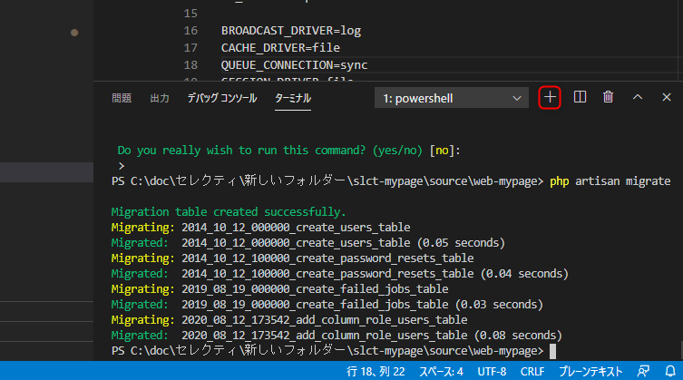

# プロジェクトの読み込みと起動
<!-- TOC -->

- [プロジェクトの読み込みと起動](#プロジェクトの読み込みと起動)
  - [プロジェクト読み込み](#プロジェクト読み込み)
    - [プロジェクトを開く](#プロジェクトを開く)
    - [ターミナルの起動](#ターミナルの起動)
    - [プロジェクトのビルド](#プロジェクトのビルド)
  - [MySQLの設定](#mysqlの設定)
  - [起動](#起動)

<!-- /TOC -->
※沼田さん作成のセレクティー様マイページ用資料を流用しています。  
画面ハードコピーなどは流用元のものになっているものが多いので、適時読み替えてください。  

## プロジェクト読み込み

### プロジェクトを開く

VSCodeを開き、「フォルダーを開く」を選択。  
既にGitHubよりクローンしたフォルダの、**以下のフォルダを開く**。  
→「web-testea」フォルダ

```
testea-mypage\source\web-testea
```


### ターミナルの起動

VSCode上でターミナルを起動する。  
(表示→ターミナル)


VSCodeの右下にターミナルが起動する。  
また、赤枠のところの「+」ボタンで複数ターミナルを起動することができ、プルダウンから切り替えることができる。  

開発時には、2つのターミナルを使用することになるので、覚えておく。


### プロジェクトのビルド

ターミナルより、以下のコマンドを実行する。

```
composer install
```

さらに以下の2つのコマンドも実行する。  

```
npm install 
npm run dev
```

上記の作業により、必要なパッケージ類がインストールされ、ビルドを行う。  
当アプリケーションでは、Viteでビルドを行う設定としている。
Viteでの`npm run dev`コマンドは、
Laravel mixでの`npm run watch`と同様に変更を動的に拾って反映してくれる。（下記画面参照）
ctrl+Cで終了すると、アプリケーションが動かなくなるので注意。


ちなみにこれらで生成されたファイルはGitHubへアップされないようになっている。

## MySQLの設定

ローカルのMySQLに、今回使用するデータベースを用意する。

XAMPPのApacheとMySQLを起動し、phpMyAdminを開く。  
http://localhost:8088/phpmyadmin/

以下の「新規作成」をクリックする。


以下のように入力し作成をクリックする。
ローカルPCなのでデータベース名は任意でよい。


次にユーザを作成する。  
「ユーザアカウント」をクリックする。


ユーザアカウントを追加する。


今回のWebアプリ用ユーザなので適当に作っておく。  
ローカルPCなので以下でも良い。  

```
例：
laravel-user / pass
```


ユーザの権限は以下のようにする。  
一番下の「実行」ボタンをクリックし、ユーザを作成する。


## 起動

VSCodeを開き、「web-testea」フォルダ直下の「.env.example」をコピーし、「.env」ファイルを作成する。

DBに関する設定を以下のように修正する。  
※DB名やユーザ名、パスワードは上記で作成したものに変更

※以下は開発環境用サンプル（モック用とはDB名を変更すること）
```
DB_CONNECTION=mysql
DB_HOST=127.0.0.1
DB_PORT=3306
DB_DATABASE=testea-mypage
DB_USERNAME=laravel-user
DB_PASSWORD=pass
```

VSCodeのターミナルより、以下を実行する。  

Laravelで作成したテーブル定義をもとに、テーブルを作成する。  
以降、開発時にテーブルの構成が変わった際も実行することになる。
```
php artisan migrate
```

テーブルにテストデータを登録する。
```
php artisan db:seed --class=MypageDummyDataSeeder
```

アプリのキーも作成する。

```
php artisan key:generate
```

ちなみに上記の実行後、テーブルが作成されていることがphpMyAdminから確認できる。


次にコマンドでサーバを起動する。  
このコマンドは実行すると、実行しっぱなしになるので、別ターミナルを起動する。  



以下のコマンドを実行する。  
今回はApacheを使用せず、この組み込みサーバを利用する。

```
php artisan serve
```

以下のURLにアクセスする。  
http://localhost:8000/

アプリケーションの画面が表示されることを確認する。


ログイン情報（Seederでデータを登録した場合　※抜粋）

|権限|ログインID|PW|
| ---- | ---- | ---- |
|管理者（全体）|admin0000@test.jp|test9999|
|管理者（久我山）|admin0001@test.jp|test9999|
|管理者（西永福）|admin0002@test.jp|test9999|
|管理者（駒込）|admin0005@test.jp|test9999|
|管理者（渋谷）|admin0011@test.jp|test9999|
|生徒１|student0001@test.jp|test9999|
|生徒２|student0002@test.jp|test9999|
|教師１|teacher0101@test.jp|test9999|
|教師２|teacher0102@test.jp|test9999|

