# GitインストールとリポジトリClone

<!-- TOC -->

- [GitインストールとリポジトリClone](#gitインストールとリポジトリclone)
  - [概要](#概要)
  - [Git for windows](#git-for-windows)
    - [インストール](#インストール)
  - [TortoiseGitのインストール](#tortoisegitのインストール)
    - [インストール](#インストール-1)
    - [設定について](#設定について)
    - [おすすめ設定(任意)](#おすすめ設定任意)
  - [リポジトリClone](#リポジトリclone)
    - [SSH秘密鍵の作成](#ssh秘密鍵の作成)
    - [GitHubの設定](#githubの設定)
    - [リポジトリをClone](#リポジトリをclone)
  - [使い方](#使い方)
    - [ブランチ](#ブランチ)
    - [最新ソースをダウンロード(pull)](#最新ソースをダウンロードpull)
    - [ソースを確定(commit)](#ソースを確定commit)
    - [ソースをリモートリポジトリに反映(push)](#ソースをリモートリポジトリに反映push)

<!-- /TOC -->
※沼田さん作成のセレクティー様マイページ用資料を流用しています。  
画面ハードコピーなどは流用元のものになっているものが多いので、適時読み替えてください。  

## 概要

- `Git`とはソースコードなどの変更履歴を記録・追跡するための管理システム。
- Git単体ではWindowsなどでも利用可能だが、`GitHub`を使いリモートリポジトリや課題の管理などを行う。
- Gitの操作は、commitやpush、pull等があるが詳しくは調べる。(最後に簡単にまとめた)

## Git for windows

### インストール

`Git for windows`をインストール。  
https://gitforwindows.org/

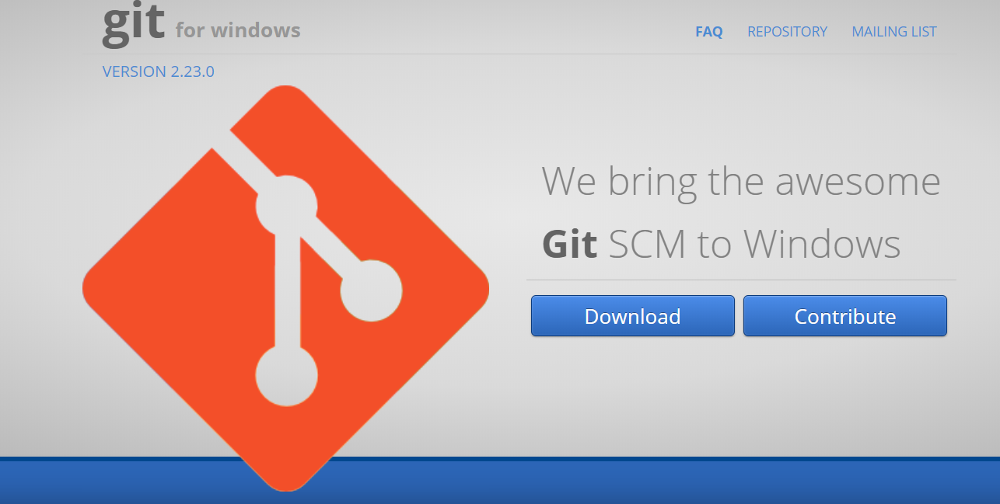

普通にインストール。

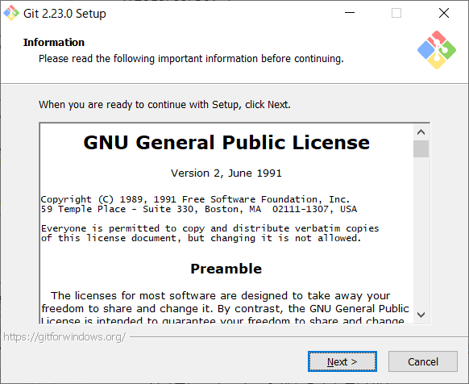


基本的にデフォルトで問題ないが、**以下の画面だけ設定を変える。**

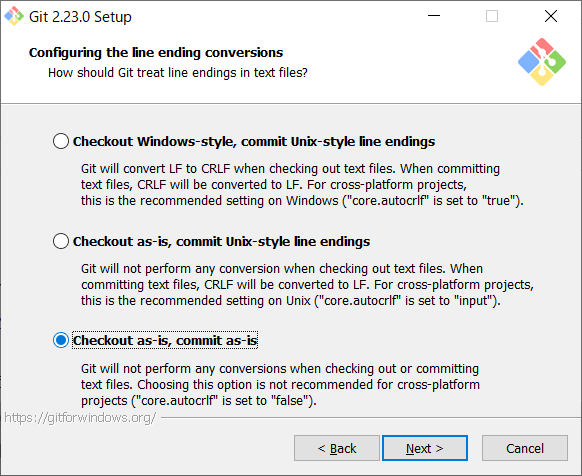

インストール後、`Git Bush`でコマンドで操作も可能。

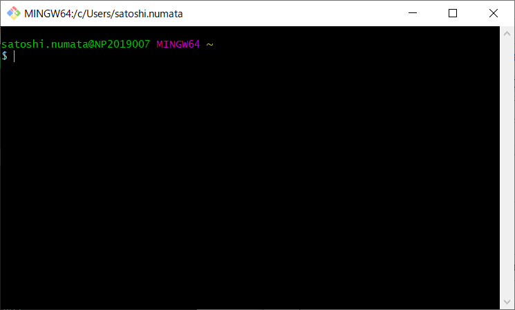

## TortoiseGitのインストール

### インストール

Git Bushの操作だけでは面倒なので、`TortoiseGit`があるの何かと便利。  
https://tortoisegit.org/

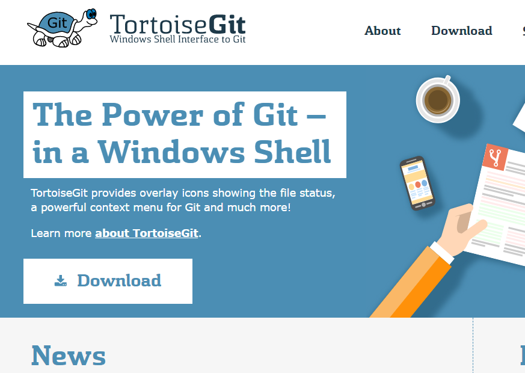

Windowsの最新インストーラをダウンロード。

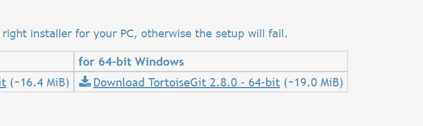

デフォルトのままインストールを完了させてOK。


### 設定について

設定について進めていく。

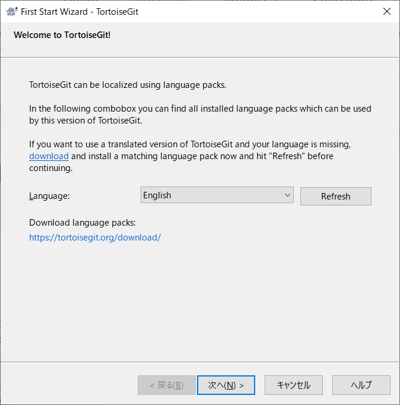

**名前とメアドは自分のものを入力。**

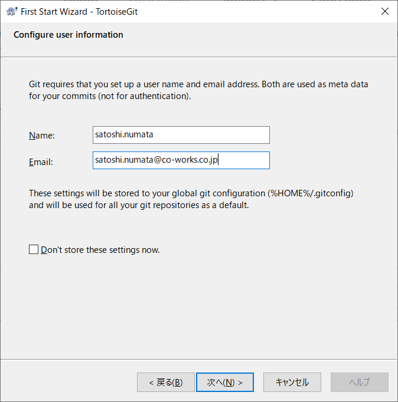

エクスプローラを右クリックで、メニューに`TortoiseGit`が追加される。   
これにより、GUIでのGitの操作が可能となる。

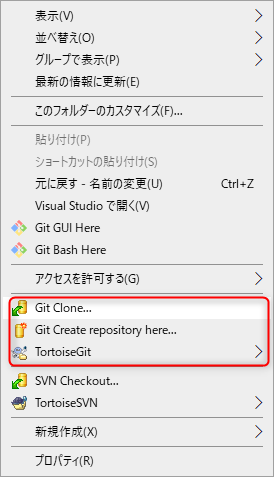

### おすすめ設定(任意)

TortoiseGitで差分を見るときは、`WinMerge`が便利。  
**※先にWinMergeをインストールする。**  
https://winmerge.org/?lang=ja

エクスプローラを右クリックし、設定を開く。

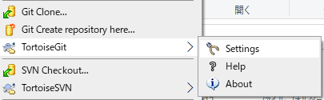

下記のメニューをクリックし、WinMergeのexeのパスを指定。

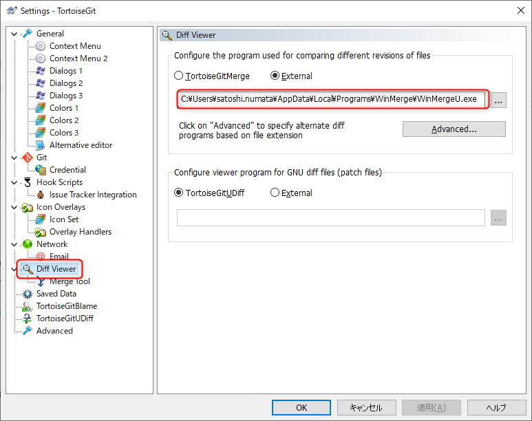

## リポジトリClone

### SSH秘密鍵の作成

`puttygen`を起動する。(TortoiseGitのインストール先から)

```
C:\Program Files\TortoiseGit\bin\puttygen.exe
```

起動直後の画面  
「Generate」ボタンをクリックし、**マウスを何度も移動する。**

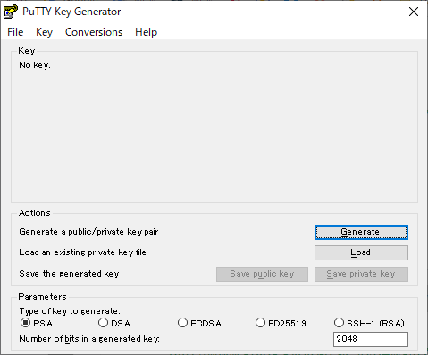

そうすると以下のように「Public Key」が表示される。  
(モザイクの部分)

後ほど使用するので、**コピーしておく。**  
(「Save public key」ボタンでも保存可能)

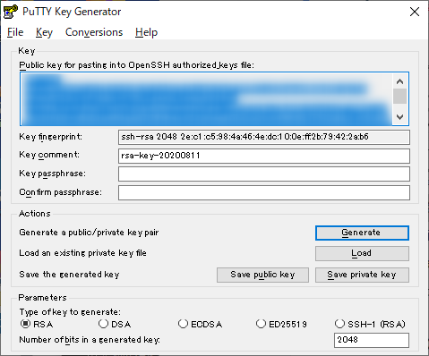

「Key passphrase」を任意で入力する。  
その後、「Save private key」をクリックし秘密鍵を保存する。  
大切に保管する。

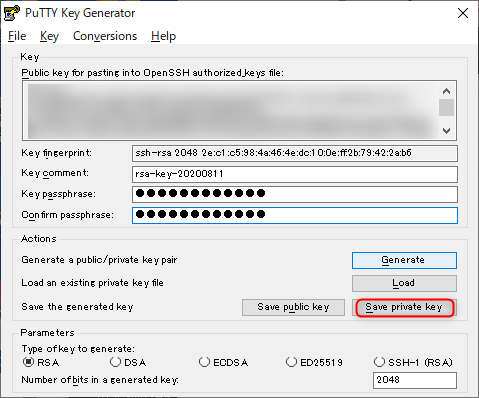


### GitHubの設定

GitHubを開き、以下の手順で画面を開く

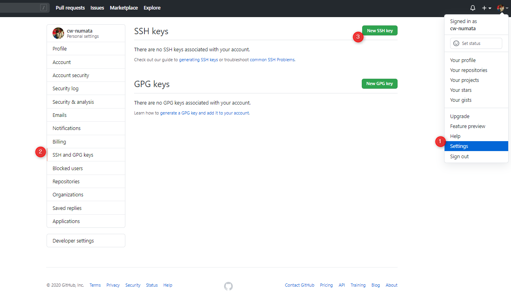

Titleは任意で、Keyはputtygenに表示された「Public Key」を入力し保存。

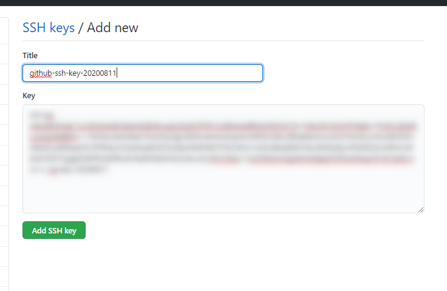


### リポジトリをClone

エクスプローラを開き、任意のフォルダで右クリックし、`Git Clone`を選択。

※mypage-sample とは別のフォルダにする


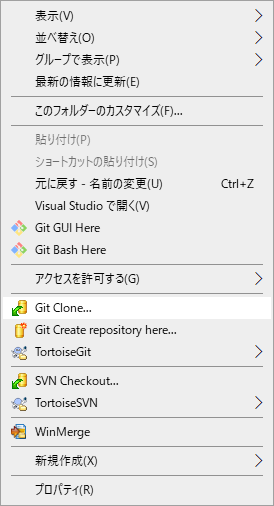

URLに以下を指定  
```
git@github.com:cw-develop/mypage-sample2.git
```

「Load Putty Key」は先程puttygenで保存した、**秘密鍵のパスを指定する。**

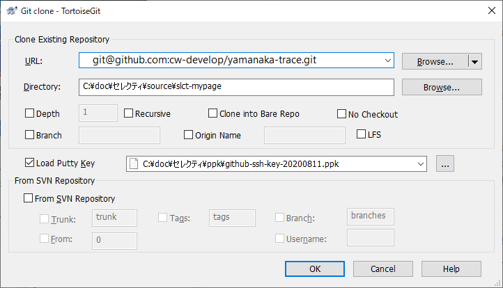

作成時に入力したパスフレーズを入力する。

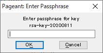

フォルダにソース一式がダウンロードされていることを確認する。


## 使い方

### ブランチ

デフォルトブランチを`develop`にしているので、特に変更しなくてもファイル類が見えていると思います。  

今後、リリースしたタイミングで`main`へマージします。  
※※開発時のブランチ運用は、決まり次第共有します※※


### 最新ソースをダウンロード(pull)

`pull`を行います。

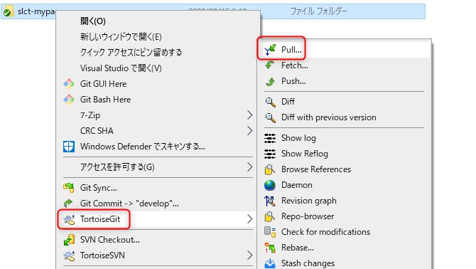

Laravel開発の場合、pullしたあとは、以下のコマンドを実行します。

```
npm run dev
```

### ソースを確定(commit)

`commit`を行います。
基本的には`develop`が選択されていることを確認してください。

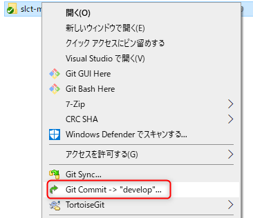

コミットメッセージには課題の番号を入力します。  
例：#8

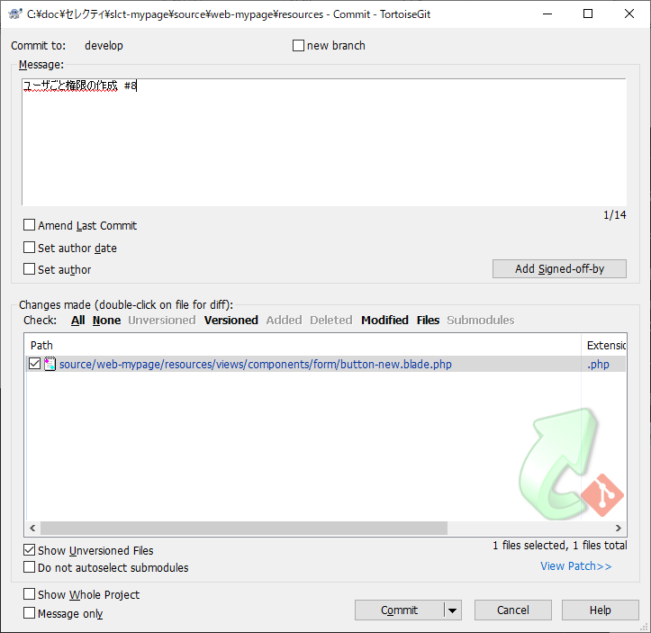

### ソースをリモートリポジトリに反映(push)

`commit`はローカルだけでの反映なので、リモートリポジトリへアップするには`push`を行います。
