# ローカルPCに開発環境構築
<!-- TOC -->

- [ローカルPCに開発環境構築](#ローカルpcに開発環境構築)
  - [Dockerのインストール](#Dockerのインストール)
    - [概要](#概要)
    - [インストール](#インストール)
  - [Node.jsのインストール](#nodejsのインストール)
  - [Comporserのインストール](#comporserのインストール)
  - [VSCodeのインストール](#vscodeのインストール)
    - [インストール](#インストール-1)
    - [プラグインのインストール](#プラグインのインストール)
    - [設定](#設定)
    - [ソースコードの整形について](#ソースコードの整形について)

<!-- /TOC -->
※沼田さん作成のセレクティー様マイページ用資料を流用しています。  
画面ハードコピーなどは流用元のものになっているものが多いので、適時読み替えてください。 

## WSLのインストール

### 概要
WSL（Windows Subsystem for Linux）は、Windows上でLinuxディストリビューションをネイティブに実行できるMicrosoftの機能です。
WSLを使うと、Windows環境でLinuxのコマンドラインツールやアプリケーションを利用できます。

### インストール

👇こちらなど参考にインストールをしてください
https://chigusa-web.com/blog/wsl2-win11/

## Dockerのインストール

### 概要

Dockerは、アプリケーションをコンテナと呼ばれる軽量な仮想環境で動作させる技術  

### 特徴
- 環境の統一: どのマシンでも同じ環境を再現できる
- 軽量: 仮想マシンよりもリソースを消費せず、高速に起動
- 移植性: 開発環境、テスト環境、本番環境で同じ動作を保証
- 依存関係の管理: アプリと必要なライブラリをまとめて管理

### インストール

👇こちらなど参考にインストールをしてください
https://chigusa-web.com/blog/windows%E3%81%ABdocker%E3%82%92%E3%82%A4%E3%83%B3%E3%82%B9%E3%83%88%E3%83%BC%E3%83%AB%E3%81%97%E3%81%A6python%E7%92%B0%E5%A2%83%E3%82%92%E6%A7%8B%E7%AF%89/

インストール後Docker Desktopを起動して`docker -v`などでインストールされてることを確認してください

```
docker -v
```

以下のようにdockerのバージョンが表示されていればOK！
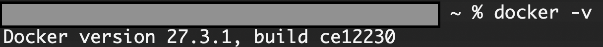


## Node.jsのインストール

Laravel開発にて、npmを使用してパッケージのインストールや、Javascriptファイルなどをビルドします。

Node.jsをインストールする。  
https://nodejs.org/ja/download/  

**※このLaravelアプリケーションのビルドを行うには、Node.jsのバージョンが16以上である必要があります。**

Windowsのインストーラをダウンロードし、インストールを完了する。

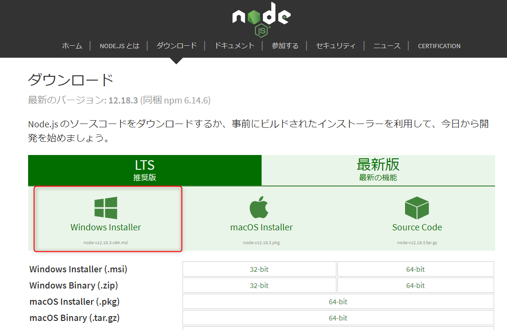


## Comporserのインストール

Comporserとは、PHP向けのパッケージ管理システムです。


以下にアクセスし、インストーラをダウンロードする。  
→Comporser - Setup.exe  
https://getcomposer.org/download/


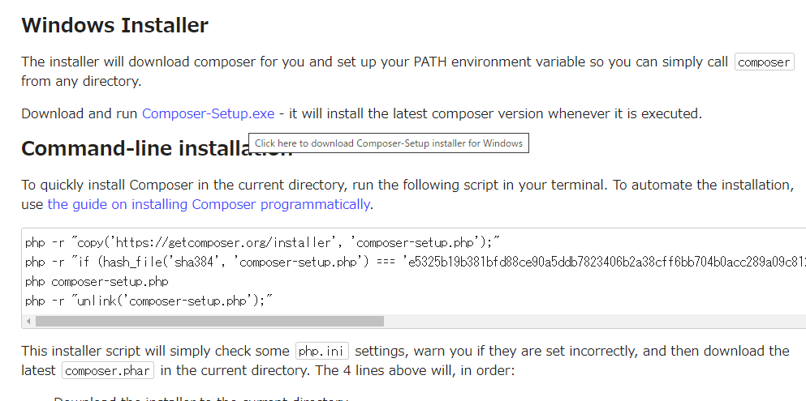

特に設定を変えずに、そのままインストールを完了させる。  
途中、既にXAMPPがインストール済みなので、そのパスが指定されていることを確認する。


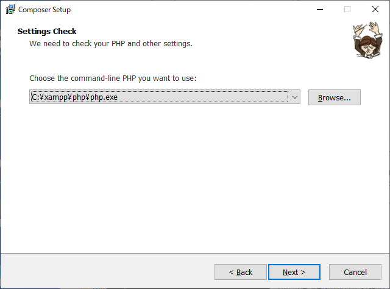


## VSCodeのインストール


### インストール

VSCodeをインストールする。  
https://code.visualstudio.com/download

Windows版をダウンロードし、普通にインストールする。

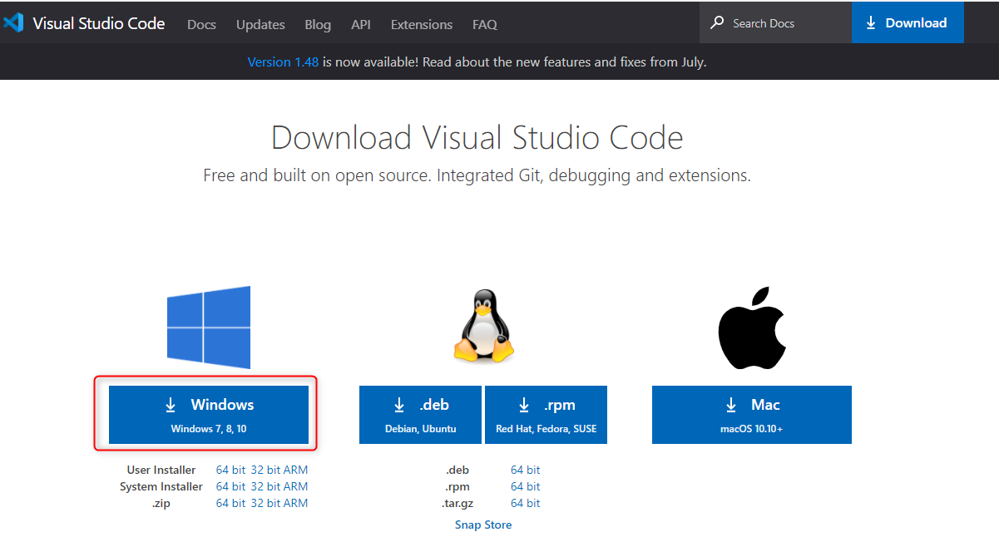

### プラグインのインストール

VSCodeの拡張機能をインストールする。  
以下のアイコンをクリックする。

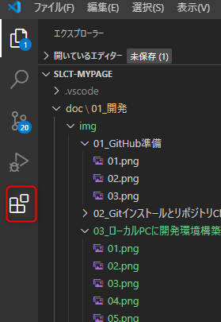

以下の赤枠の通り検索ボックスに入力し、インストールしていく。

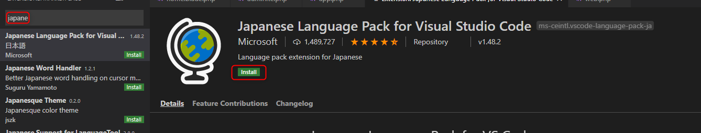

1. Japanese Language Pack for Visual Studio Code  
日本語化  
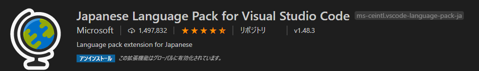

2. Laravel Blade Snippets  
LaravelのテンプレートのBladeをサポートする。  
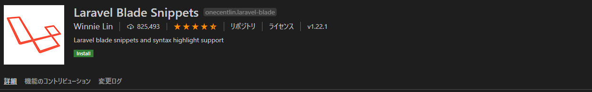

3. Laravel Assist  
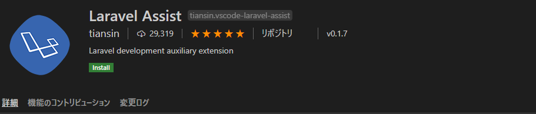

4. PHP Intelephense  
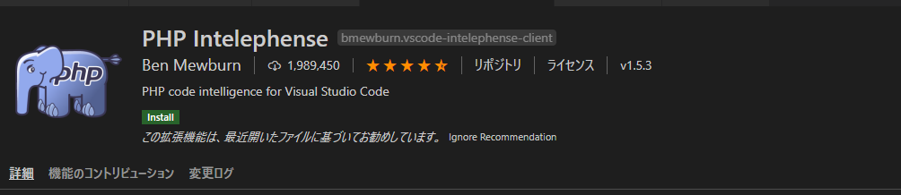

5. Prettier - Code formatter  
ソースコードの整形(フォーマッター)  
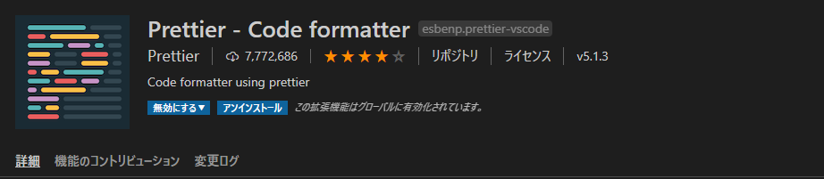

6. zenkaku  
全角を表示する  


7. Vetur  
Vueの開発用  
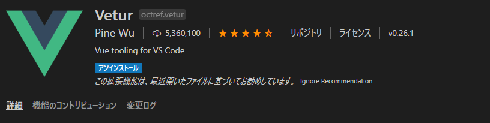


### 設定

VSCodeの設定を開く。

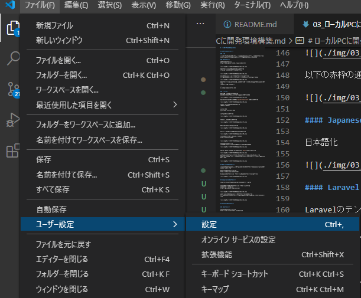

`blade.format.enable`と入力し、チェックを入れる。

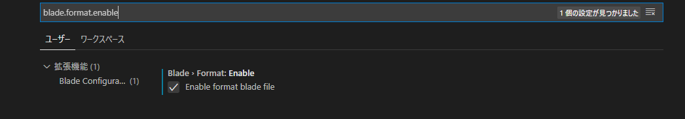


### ソースコードの整形について

VSCodeでソースを開いているとき、以下のショートカットでソースコードの整形ができます。  

```
shift+alt+F
```

- Gitのコミット前にはソースを整形しておく
- ショートカットを押した際、どのフォーマッタを使うか聞かれたら、`Prettier`を指定する。

