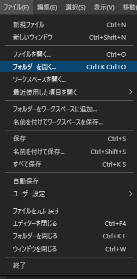
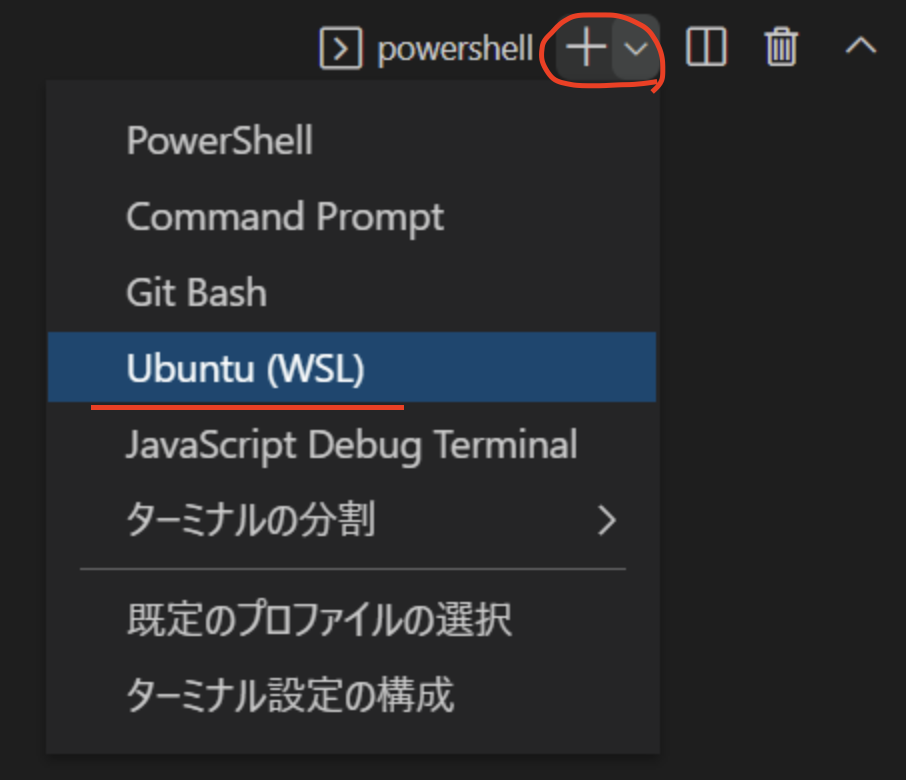
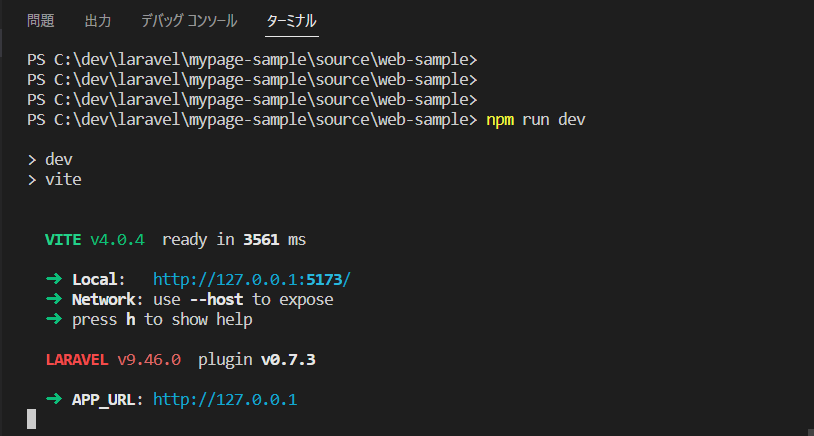
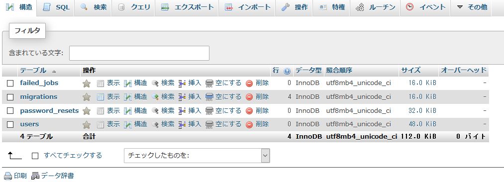
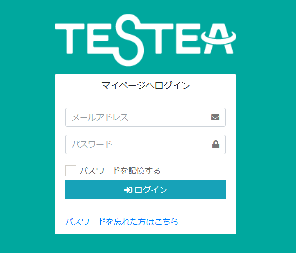

# プロジェクトの読み込みと起動
<!-- TOC -->

- [プロジェクトの読み込みと起動](#プロジェクトの読み込みと起動)
  - [プロジェクト読み込み](#プロジェクト読み込み)
    - [プロジェクトを開く](#プロジェクトを開く)
  - [環境変数設定](#環境変数設定)
  - [起動](#起動)
    - [ターミナルの起動](#ターミナルの起動)
    - [プロジェクトのビルド](#プロジェクトのビルド)

<!-- /TOC -->
※沼田さん作成のセレクティー様マイページ用資料を流用しています。  
画面ハードコピーなどは流用元のものになっているものが多いので、適時読み替えてください。  

## プロジェクト読み込み

### プロジェクトを開く

VSCodeを開き、「フォルダーを開く」を選択。  
既にGitHubよりクローンしたフォルダの、**以下のフォルダを開く**。  
→「web-sample2」フォルダ

```
mypage-sample2\source\web-sample2
```




## 環境変数設定

VSCodeを開き、「web-sample2」フォルダ直下の「.env.example」をコピーし、「.env」ファイルを作成する。

DBに関する設定を以下のように修正する。  
※DB名やユーザ名、パスワードは上記で作成したものに変更

**DB＿HOSTがmysqlになるというところ注意してください。**  
※xamppで環境構築していた時は`DB_HOST=127.0.0.1`となっていた。
```
DB_CONNECTION=mysql
DB_HOST=mysql
DB_PORT=3306
DB_DATABASE=任意
DB_USERNAME=任意
DB_PASSWORD=任意
```


## 起動

### ターミナルの起動

VSCode上でターミナルを起動する。  
(表示→ターミナル)


VSCodeの右下にターミナルが起動する。  
また、赤枠のところの「+」ボタンで複数ターミナルを起動することができ、プルダウンから切り替えることができる。  

**今回はUbuntu(WSL)ターミナルを使用する**




### composerインストール

ターミナルからコマンドで以下実行してください。
```
docker run --rm \
    -u "$(id -u):$(id -g)" \
    -v $(pwd):/var/www/html \
    -w /var/www/html \
    laravelsail/php83-composer:latest \
    composer install --ignore-platform-reqs
```
※`php83`の部分はphpのバージョンを指しています。  
今回はphp8.3という意味。
環境に合わせて変更してください。

これでローカルにcomposerをインストールしなくてもsailを起動できるようになりました。  
 

## コンテナ起動

Laravel SailのDockerコンテナを起動する。  
初回は10分くらいかかる場合もあります。  
```
./vendor/bin/sail up -d
```

立ち上がったコンテナの確認は`docker ps -a`コマンドで確認できる。  

ちなみに立ち上げたコンテナを落とす時は  
```
./vendor/bin/sail down
```

### ./vendor/bin/sailのエイリアス設定

今後、Laravel Sail環境下では以下のようにコマンドを実行していく、
```
./vendor/bin/sail [コマンド]
```

しかし、`./vendor/bin/sail`が長いため、エイリアス設定をする。  

Ubuntu(WSL)ターミナルで以下実行
```
alias sail='[ -f sail ] && sh sail || sh vendor/bin/sail'
```

こうすることでコマンド実行は以下のように短縮して実行できる。
```
sail [コマンド]
```

例えば、コンテナの立ち上げと落とす時は以下のようになります。  
```
sail up -d
sail down
```

これより下ではエイリアス設定が済んでいて、`sail`でコマンド実行ができる前提で進めます。  


## 起動

以下の2つのコマンド実行する。  

```
sail npm install 
sail npm run dev
```

上記の作業により、必要なパッケージ類がインストールされ、ビルドを行う。  
当アプリケーションでは、Viteでビルドを行う設定としている。
Viteでの`npm run dev`コマンドは、
Laravel mixでの`npm run watch`と同様に変更を動的に拾って反映してくれる。（下記画面参照）
ctrl+Cで終了すると、アプリケーションが動かなくなるので注意。



ちなみにこれらで生成されたファイルはGitHubへアップされないようになっている。


VSCodeのターミナルより、以下を実行する。  

```
sail php artisan migrate
```

テーブルにテストデータを登録する。
```
sail php artisan db:seed --class=MypageDummyDataSeeder
```

アプリのキーも作成する。

```
sail php artisan key:generate
```

ちなみに上記の実行後、テーブルが作成されていることがphpMyAdminから確認できる。
http://localhost:8088  



今回は組み込みサーバを使用せず、nginxを利用するため`php artisan serveは不要`  

以下のURLにアクセスする。  
http://localhost:8000/

アプリケーションの画面が表示されることを確認する。





ログイン情報（Seederでデータを登録した場合　※抜粋）

|権限|ログインID|PW|
| ---- | ---- | ---- |
|管理者（全体）|admin0000@test.jp|test9999|
|管理者（久我山）|admin0001@test.jp|test9999|
|管理者（西永福）|admin0002@test.jp|test9999|
|管理者（駒込）|admin0005@test.jp|test9999|
|管理者（渋谷）|admin0011@test.jp|test9999|
|生徒１|student0001@test.jp|test9999|
|生徒２|student0002@test.jp|test9999|
|教師１|teacher0101@test.jp|test9999|
|教師２|teacher0102@test.jp|test9999|

